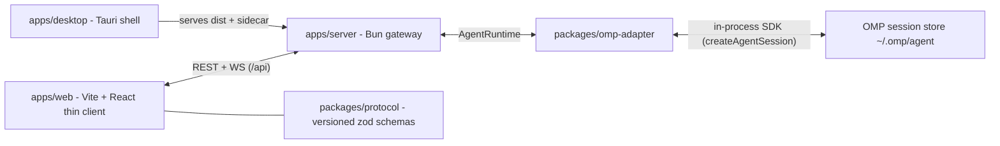

# Grove

Web UI with the full capability set of the Oh My Pi (OMP) TUI — chat streaming, sessions/tree/branch, the whole tool surface (read/write/edit/bash/eval/hub/task/todo/lsp/debug/browser), Agent Hub, providers/models/MCP/skills/memory/settings/theme/auth — plus a Tauri v2 desktop shell that ships the same stack as a native app.

The invariant: **thin client + gateway**. The browser never parses JSONL and never re-implements session/model/credential resolution. All of that lives in `apps/server` + `packages/omp-adapter`, which drives the OMP SDK in-process.

## Architecture



- `apps/server` owns the runtime: one `SdkAdapter` (`packages/omp-adapter`) over `createAgentSession`. No `omp --mode rpc` child, no fallback runtime.
- `apps/web` talks only to `apps/web/src/lib/api-client` (typed against `packages/protocol`). It must not import `apps/server`, `packages/omp-adapter`, or OMP.
- Swapping the runtime means writing a new `AgentRuntime` implementation (`packages/agent-runtime`) — the UI and wire protocol stay as they are.

## Requirements

- **Bun ≥ 1.3.14** on every platform (runtime + package manager; no Node, no npm/pnpm/yarn lockfiles)
- OMP credentials/settings under `~/.omp/` (Windows: `%USERPROFILE%\.omp`) — user scope, never in this repo
- Desktop packaging additionally needs a Rust toolchain and the platform's Tauri prerequisites (macOS or Windows x64 only — see [Setup by environment](#setup-by-environment))
- Playwright's Chromium for `bun run e2e`

## Quickstart

```sh
bun install
bun run dev            # web on :5173 + server on :8787
```

Open <http://localhost:5173>, then **New session** in the sidebar and start prompting. `bun run dev:web` / `bun run dev:server` run one side only; the Vite dev server proxies `/api` to `GROVE_PORT` (default `8787`).

## Setup by environment

### Install files

Two kinds of "installer", depending on what you need:

| Need | macOS | Windows |
|---|---|---|
| **Dev environment** (this repo on a clean machine) | `sh install.sh` — or `curl -fsSL https://raw.githubusercontent.com/phonnt/grove/main/install.sh \| sh` | `pwsh -File install.ps1` — or `powershell -c "irm https://raw.githubusercontent.com/phonnt/grove/main/install.ps1 \| iex"` |
| **The desktop app** | `dist/macos/Grove-<version>-macos-arm64.{dmg,zip}` from `bun run dist:macos`, or the draft release built by a `desktop-v*` tag | `.../bundle/nsis/*.exe` from `tauri build --no-sign` (CI artifact `grove-windows`), or the same draft release |

Both installers ship from one draft release: `git tag -a desktop-v0.1.0 -m "…" && git push origin desktop-v0.1.0` runs `verify` + `windows` and then attaches the macOS `*.dmg`/`*.zip` and the Windows `*_x64-setup.exe` to it (see `docs/desktop-release.md`).

The bootstrap scripts install Bun when missing, install workspace dependencies and delegate to `bun run setup`, so `install.sh --e2e --desktop` is the whole story for a dev machine. Both are safe to re-run and need no sudo; anything that would elevate (winget, apt, `xcode-select`) is printed, not run. `install.sh --clone <dir>` fetches the repository first.

### One command per environment

Everything except Bun itself is one command per platform — `bun run setup` checks
this machine and prints (or with `--install` runs) whatever is missing:

| Environment | One command | Covers |
|---|---|---|
| macOS / Linux | `sh install.sh` (or the curl one-liner above) | Bun, deps, dev stack |
| macOS / Linux, rest | `bun run setup --e2e --desktop` (add `--install` to run rustup + Chromium) | Playwright Chromium, Rust, Xcode CLT |
| Windows | `pwsh -File install.ps1` (or the irm one-liner above) | Bun, deps, dev stack |
| Windows, rest | `bun run setup --desktop` (add `--install` for rustup) | Rust, MSVC Build Tools, WebView2 |

Bun has to exist before any `bun run` works, hence step zero in every row. Steps
that need elevation or a GUI (winget, apt, `xcode-select --install`) are always
printed for you to run rather than executed invisibly; `--install` only runs
non-privileged installers (rustup, `playwright install`). Exit code is 1 when Bun
is missing or too old, 0 otherwise (a missing optional prerequisite is reported,
not fatal).

The dev stack (web + server) runs anywhere Bun runs, because the OMP native addon ships for every target. **Desktop packaging is narrower**: only the pairs wired in `scripts/build-desktop.ts` and given a bundle config are supported. In the table below, ✅ means CI or this machine actually exercises it: `bun run check` boots the server, `bun run e2e` drives the real web UI against it.

| Environment | Web + server dev | `bun run e2e` | Desktop app build |
|---|---|---|---|
| macOS arm64 (Apple Silicon) | ✅ | ✅ | ✅ `bun run dist:macos` → DMG + zip |
| macOS x86_64 (Intel) | expected¹ | expected | ❌ `platformTarget('darwin','x64')` throws |
| Windows x64 | ✅ (CI `windows`) | expected | ✅ `tauri build --no-sign` → NSIS |
| Windows arm64 | expected | expected | ❌ throws |
| Linux x64 | ✅ (CI `ubuntu-latest`) | ✅ (CI `ubuntu-latest`) | ❌ throws (no bundler config, no CI job) |
| Linux arm64 | expected | expected | ❌ throws |

¹ **expected** = the OMP native addon ships for that target (the lockfile carries darwin/linux/win32 for arm64 + x64), but nothing in CI or on this machine runs it, so it is unverified rather than proven. CI runs `check` (which boots the server) on Windows and Linux x64; e2e runs on Linux x64.

An unsupported desktop target fails loudly at `build:desktop` (`unsupported platform: <os>/<arch>`); adding one means extending `platformTarget()` with the sidecar triple + addon filename and adding a `tauri.<os>.conf.json`.

### macOS

```sh
# 1. dev stack (the first command also installs Bun if it is missing)
curl -fsSL https://bun.sh/install | bash && bun install && bun run dev   # http://localhost:5173

# 2. optional: e2e and desktop packaging prerequisites
bun run setup --e2e --desktop --install      # rustup + Chromium; prints xcode-select --install

# 3. optional: build the app
bun run dist:macos                           # -> dist/macos/*.dmg + *.zip
```

The DMG is unsigned + ad-hoc sealed (Apple Silicon requires that seal to launch); not notarized, so Gatekeeper warns on downloaded copies — see `docs/runbook.md#desktop`. macOS **arm64 only**; Intel Macs can run the dev stack but cannot build the app.

### Windows (PowerShell)

```powershell
# 1. dev stack (the first command also installs Bun if it is missing)
powershell -c "irm bun.sh/install.ps1 | iex"; bun install; bun run dev

# 2. optional: desktop packaging prerequisites (prints the winget lines for you)
bun run setup --desktop --install      # rustup runs; winget steps are printed

# 3. optional: build the installer (x64, unsigned)
bun run build:desktop
cd apps/desktop; bun run tauri build --no-sign   # -> src-tauri/target/release/bundle/nsis/*.exe
```

Bun is the only runtime for the dev server and tests; Node is never used. The installer is unsigned (SmartScreen → More info → Run anyway) and Windows **x64 only** — arm64 can run the dev stack but not build the app. MSI packaging additionally needs the VBSCRIPT Windows feature; this repo builds NSIS only, so it is not required. GUI-level checks need a real machine: [issue #1](https://github.com/phonnt/grove/issues/1).

### Linux

```sh
curl -fsSL https://bun.sh/install | bash && bun install && bun run dev
bun run setup --e2e                            # prints: bunx playwright install --with-deps chromium
```

The dev stack and the Playwright suite both run here (CI runs `bun run check` and `bun run e2e` on Ubuntu). The desktop app does **not** build on Linux today; if that changes, Tauri needs its Linux system deps (`libwebkit2gtk-4.1-dev`, `build-essential`, `libxdo-dev`, `libssl-dev`, `libayatana-appindicator3-dev`, `librsvg2-dev`) plus a `platformTarget()` entry.

## Commands

| Command | What it does |
|---|---|
| `bun run setup` | check this machine for the dev stack (add `--e2e`/`--desktop`, `--install` to run fixes; `--help`) |
| `bun run dev` | web + server concurrently, prefixed logs |
| `bun run dev:web` / `bun run dev:server` | one side only |
| `bun run check` | **the CI gate**: typecheck + Biome + `bun test` + server smoke |
| `bun run typecheck` | `tsc --noEmit` across every workspace |
| `bun run lint` / `bun run format` | Biome check / Biome write |
| `bun run test` | `bun test ./packages ./apps ./scripts` |
| `bun run e2e` | Playwright stack smoke (needs `bunx playwright install chromium`) |
| `bun run build:desktop` | web dist + compiled sidecar + native addon + manifest |
| `bun run smoke:sidecar` / `bun run smoke:bundle` | sidecar health probe / launch the `.app` and assert the sidecar lifecycle |
| `bun run dist:macos` | `dist/macos/Grove-<version>-macos-<arch>.{dmg,zip}` |

`bun run check` must be green before a commit; it also boots the server (`scripts/smoke-server.ts`) so a broken import cannot pass typecheck silently. CI (`.github/workflows/ci.yml`) runs `bun run check` and the Playwright suite, because specs that are not run by a gate rot.

## Layout

```text
apps/web/         thin client (Vite + React) — src/app (router/store/query), src/features/*, src/lib/api-client
apps/server/      Bun HTTP + WS gateway — src/routes, src/stream, src/runtime
apps/desktop/     Tauri v2 shell — serves the web dist, runs the server as a sidecar
packages/core/            pure domain types + guards (zero I/O)
packages/agent-runtime/   AgentRuntime interface + typed errors
packages/omp-adapter/     the only OMP integration point
packages/protocol/        versioned REST/WS wire schemas (zod)
packages/ui/              shared shadcn components + styles
packages/config/          shared tsconfig / Biome / Tailwind preset
tests/                    integration + Playwright specs
scripts/                  dev, check, typecheck, smoke:*, build:desktop, dist:macos
docs/                     architecture, design system, runbook, parity tracker
```

Dependency rule (no cycles): `core` and `ui` are standalone; `protocol`/`agent-runtime` depend on `core` (types only); `omp-adapter` → `agent-runtime`; `apps/server` → `omp-adapter` + `protocol`; `apps/web` → `core` + `protocol` + `ui` only. New apps/packages must extend `packages/config/tsconfig.base.json`.

## Configuration

- `GROVE_PORT` — server HTTP+WS port (default `8787`), see `.env.example`
- `.env` is git-ignored and never committed; keys are documented in `.env.example`
- Server state that is in-memory only resets on restart (session cwd registry, hub/tool registries) — see `docs/runbook.md`

## Documentation

| Doc | Contents |
|---|---|
| `AGENTS.md` | binding repo rules for humans and agents |
| `docs/architecture.md` | architecture, contracts, roadmap |
| `docs/design-system.md` | tokens, components, patterns |
| `docs/tui-parity-status.md` | **single source of truth** for OMP TUI parity (status + evidence + changelog) |
| `docs/runbook.md` | how to run/debug/operate, troubleshooting |
| `docs/desktop-release.md` | desktop build, signing, updater manifest |

## Status

Parity with the TUI is tracked per item with observed evidence in `docs/tui-parity-status.md`. As of 2026-09-20 the platform, chat, sessions/tree, modes, tools, hub and settings planes are largely done; the known gaps are tracked there as 🟡/⬜ (interactive PTY, live collab host/guest, provider OAuth login in the browser, `/install`/marketplace writes, `/ssh` + `/git` surfaces, plan-mode `defaultOnStartup`, checkpoint rewind), and the deliberate non-goals are listed in §8 of that file.
