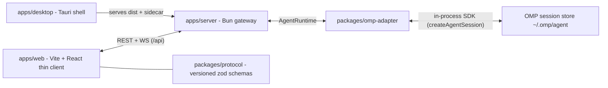

# Grove

Web UI with the full capability set of the Oh My Pi (OMP) TUI — chat streaming, sessions/tree/branch, the whole tool surface (read/write/edit/bash/eval/hub/task/todo/lsp/debug/browser), Agent Hub, providers/models/MCP/skills/memory/settings/theme/auth — plus a Tauri v2 desktop shell that ships the same stack as a native app.

The invariant: **thin client + gateway**. The browser never parses JSONL and never re-implements session/model/credential resolution. All of that lives in `apps/server` + `packages/omp-adapter`, which drives the OMP SDK in-process.

## Architecture



- `apps/server` owns the runtime: one `SdkAdapter` (`packages/omp-adapter`) over `createAgentSession`. No `omp --mode rpc` child, no fallback runtime.
- `apps/web` talks only to `apps/web/src/lib/api-client` (typed against `packages/protocol`). It must not import `apps/server`, `packages/omp-adapter`, or OMP.
- Swapping the runtime means writing a new `AgentRuntime` implementation (`packages/agent-runtime`) — the UI and wire protocol stay as they are.

## Requirements

- Bun ≥ 1.3.14 (runtime + package manager; no Node, no npm/pnpm/yarn lockfiles)
- OMP credentials/settings under `~/.omp/` (user scope, never in this repo)
- For the desktop app: a Rust toolchain + Tauri v2 prerequisites (macOS, or Windows x64)

## Quickstart

```sh
bun install
bun run dev            # web on :5173 + server on :8787
```

Open <http://localhost:5173>, then **New session** in the sidebar and start prompting. `bun run dev:web` / `bun run dev:server` run one side only; the Vite dev server proxies `/api` to `GROVE_PORT` (default `8787`).

## Commands

| Command | What it does |
|---|---|
| `bun run dev` | web + server concurrently, prefixed logs |
| `bun run dev:web` / `bun run dev:server` | one side only |
| `bun run check` | **the CI gate**: typecheck + Biome + `bun test` + server smoke |
| `bun run typecheck` | `tsc --noEmit` across every workspace |
| `bun run lint` / `bun run format` | Biome check / Biome write |
| `bun run test` | `bun test ./packages ./apps ./scripts` |
| `bun run e2e` | Playwright stack smoke (needs `bunx playwright install chromium`) |
| `bun run build:desktop` | web dist + compiled sidecar + native addon + manifest |
| `bun run smoke:sidecar` / `bun run smoke:bundle` | sidecar health probe / launch the `.app` and assert the sidecar lifecycle |
| `bun run dist:macos` | `dist/macos/Grove-<version>-macos-<arch>.{dmg,zip}` |

`bun run check` must be green before a commit; it also boots the server (`scripts/smoke-server.ts`) so a broken import cannot pass typecheck silently. CI (`.github/workflows/ci.yml`) runs `bun run check` and the Playwright suite, because specs that are not run by a gate rot.

## Layout

```text
apps/web/         thin client (Vite + React) — src/app (router/store/query), src/features/*, src/lib/api-client
apps/server/      Bun HTTP + WS gateway — src/routes, src/stream, src/runtime
apps/desktop/     Tauri v2 shell — serves the web dist, runs the server as a sidecar
packages/core/            pure domain types + guards (zero I/O)
packages/agent-runtime/   AgentRuntime interface + typed errors
packages/omp-adapter/     the only OMP integration point
packages/protocol/        versioned REST/WS wire schemas (zod)
packages/ui/              shared shadcn components + styles
packages/config/          shared tsconfig / Biome / Tailwind preset
tests/                    integration + Playwright specs
scripts/                  dev, check, typecheck, smoke:*, build:desktop, dist:macos
docs/                     architecture, design system, runbook, parity tracker
```

Dependency rule (no cycles): `core` and `ui` are standalone; `protocol`/`agent-runtime` depend on `core` (types only); `omp-adapter` → `agent-runtime`; `apps/server` → `omp-adapter` + `protocol`; `apps/web` → `core` + `protocol` + `ui` only. New apps/packages must extend `packages/config/tsconfig.base.json`.

## Configuration

- `GROVE_PORT` — server HTTP+WS port (default `8787`), see `.env.example`
- `.env` is git-ignored and never committed; keys are documented in `.env.example`
- Server state that is in-memory only resets on restart (session cwd registry, hub/tool registries) — see `docs/runbook.md`

## Documentation

| Doc | Contents |
|---|---|
| `AGENTS.md` | binding repo rules for humans and agents |
| `docs/architecture.md` | architecture, contracts, roadmap |
| `docs/design-system.md` | tokens, components, patterns |
| `docs/tui-parity-status.md` | **single source of truth** for OMP TUI parity (status + evidence + changelog) |
| `docs/runbook.md` | how to run/debug/operate, troubleshooting |
| `docs/desktop-release.md` | desktop build, signing, updater manifest |

## Status

Parity with the TUI is tracked per item with observed evidence in `docs/tui-parity-status.md`. As of 2026-09-20 the platform, chat, sessions/tree, modes, tools, hub and settings planes are largely done; the known gaps are tracked there as 🟡/⬜ (interactive PTY, live collab host/guest, provider OAuth login in the browser, `/install`/marketplace writes, `/ssh` + `/git` surfaces, plan-mode `defaultOnStartup`, checkpoint rewind), and the deliberate non-goals are listed in §8 of that file.
