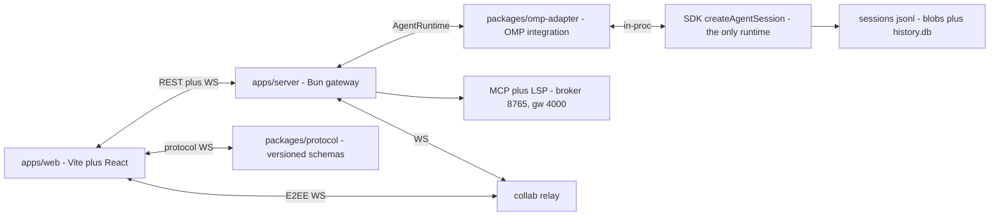

# AI-GUI Web UI — Kiến trúc & Kế hoạch

> Mục tiêu: web UI có đầy đủ khả năng OMP. Nguyên tắc bất biến: **thin client + gateway** — browser không parse JSONL, không re-implement resolution logic. Mọi state chuẩn nằm ở backend gateway + `omp --mode rpc` / SDK.
> Trạng thái repo: greenfield (chỉ có `AGENTS.md`). Doc này là prescription để review trước khi scaffold P0.

## 1. Tổng quan

- **Cái gì:** Web UI tương đương TUI OMP: chat streaming, sessions/tree/branch, tools (read/write/edit/bash/eval/hub/task/todo/lsp/debug/browser), Agent Hub + collab, providers/models/MCP/skills/memory/settings/theme/auth.
- **Cái gì không:** Không fork OMP, không re-implement session store / model registry / MCP lifecycle / credential ladder ở frontend. Không commit `.env`, không parse `~/.omp/agent/sessions/*.jsonl` từ browser.
- **Căn cứ docs OMP:** `omp://session.md`, `omp://rpc.md`, `omp://sdk.md`, `omp://session-operations-export-share-fork-resume.md`, `omp://session-tree-plan.md`, `omp://agent-hub.md`, `omp://collab.md`, `omp://tools/*.md`, `omp://providers.md`, `omp://models.md`, `omp://mcp-*.md`, `omp://skills.md`, `omp://memory.md`, `omp://settings.md`, `omp://theme.md`, `omp://auth-broker-gateway.md`, `omp://tui*.md`.

## 2. Tech stack (chốt)

| Lớp | Chọn | Ghi chú |
|---|---|---|
| Runtime + PM | Bun ≥1.3.14, Bun workspaces (`apps/*`, `packages/*`), 1 lockfile `bun.lock` | Theo `AGENTS.md`; SDK yêu cầu Bun |
| Backend gateway | `packages/gateway` — Bun + TypeScript strict | Spawn `omp --mode rpc` per session, multiplex stdio↔WS; Adapter pattern nên UI không biết OMP (xem §3–§4) |
| FE app | `apps/web` — Vite + React + TypeScript strict | Thin client, chỉ gọi `packages/api-client` + `packages/types` |
| Styling | `tailwindcss` + `tailwind-merge` + `clsx` + `class-variance-authority` | Utility-first; `cva` cho variants; preset chung ở `packages/config/tailwind` |
| Components | `shadcn/ui` trong `packages/ui` (Radix primitives: `@radix-ui/*`, icons `lucide-react`) | Copy-on-own: vendor vào `packages/ui`, không phụ thuộc registry ngoài lúc build; Radix cho dialog/tabs/tooltip/dropdown, `cva` cho variants |
| Routing | `react-router-dom` | `/`, `/s/:id`, `/agent/:id`, `/join/:link` |
| Server state | `@tanstack/react-query` + `packages/api-client` (fetch + WS typed) | Query cho REST (sessions/messages/tree), WS client riêng cho stream (id correlation, paging) |
| Client state | `zustand` | Store explicit ở `apps/web/src/app/store.ts` (hợp `AGENTS.md` signals/zustand-style); không prop-drill >2 tầng |
| Virtualized list | `@tanstack/react-virtual` | Transcript history append-only + live viewport |
| Markdown | `react-markdown` + `remark-gfm` | Render message/markdown, tool result |
| Terminal | `@xterm/xterm` + `@xterm/addon-fit` (+ `addon-webgl` optional) | PTY + non-PTY tail, truncation bar |
| Editor | `@uiw/react-codemirror` + `@codemirror/*` (mặc định) | Hashline gutter + diff preview + diagnostics; Monaco chỉ là alternative — ghi ADR nếu đổi |
| Forms/validation | `react-hook-form` + `zod` | Transport form MCP, settings schema-driven, theme pickers |
| Icons | `lucide-react` | Dùng chung toàn UI, không thêm icon lib khác |
| Realtime | WebSocket `/sessions/:id/stream` | Proxy RPC events; SSE/long-poll chỉ cho broker snapshot proxy |
| Notebook (eval) | Custom cells trên WS | py\|js, title/timeout/reset, stream/cancel |
| Test | `vitest` (DOM) / `bun test` (logic); Playwright E2E để P5 | Theo `AGENTS.md` Testing & QA; P5 mới thêm E2E (đã chốt 2026-09-07) |
| Lint/format | **Biome** (đã chốt 2026-09-07) | Một tool cho lint+format; `bun run check` = typecheck + lint + test; config chung `packages/config` |
| Auth E2EE (collab) | WebCrypto AES-GCM client-side | Key trong URL fragment, relay chỉ thấy roomId/ciphertext; tham khảo `packages/collab-web` |

Pin sau khi chốt: `tsconfig.json` với `strict`, `noUncheckedIndexedAccess`, `moduleResolution: bundler`; Tailwind preset + shadcn setup nằm ở `packages/config`, `packages/ui` re-export.

## 3. Kiến trúc



- **Session core:** JSONL append-only tree + `leafId` mutable. Mọi op (`new/drop/restart/fresh/clear/fork/resume/switch/tree/branch/label/export/dump/share`) có guard streaming + rollback + event — gateway sở hữu, frontend chỉ gọi + render optimistic có khóa.
- **Runtime:** SDK in-process duy nhất (`SdkAdapter` qua `createAgentSession`). Không còn `omp --mode rpc` child, không fallback, không `AI_GUI_RUNTIME`.
- **TUI parity:** history append+ack immutable vs viewport diff; tool cards 3-tier (full/folded/label); overlay chỉ composite viewport. Web map tương ứng: virtualized list + collapsible cards.
- **Hub/collab:** registry + progress events → roster; steer = prompt path thường; parked focus = revive; collab host-authoritative, guest không peer (frames: welcome/snapshot-chunk/entry/event/state/bus/agents/ui-request).
- **Extension plane:** providers/models.yml/registry/auth ladder, MCP deferred tools + `#onToolsChanged`, skills first-wins, hooks→extension-runner, memory backends, settings layers (deep-merge object, replace array), theme tokens, broker vault + gateway proxy. Tất cả resolve ở backend.

## 4. Source structure (monorepo Bun workspaces) — CHỐT theo cấu trúc của bạn

Verdict: hợp lý. Giữ nguyên `apps/web` + `apps/server` + `packages/core|agent-runtime|omp-adapter|protocol|ui`, cộng 2 chỉnh nhỏ: (a) thêm `packages/config` (share tsconfig/eslint/tailwind — không có là drift); (b) typed client sống trong `apps/web/src/lib/api-client` (dùng `protocol` schemas), chưa tách package riêng — khi nào `apps/desktop` cần mới tách thành `packages/api-client`.

```text
AI-GUI/
  AGENTS.md
  package.json                # workspaces: apps/*, packages/*
  bun.lock
  tsconfig.json               # base, các app/pkg extend
  docs/
    architecture.md           # file này
    decisions/                # ADR: rpc-vs-sdk, codemirror-vs-monaco, ...
    runbook.md                # cách chạy/debug (sau P0)
  apps/
    web/                      # THIN CLIENT duy nhất hôm nay (Vite + React)
      index.html
      src/
        main.tsx              # entry duy nhất của web
        app/                  # composition root: router, store, providers
          router.tsx          # /, /s/:id, /agent/:id, /join/:link
          store.ts            # zustand shared state
          query-client.ts     # @tanstack/react-query setup
        features/             # mỗi feature: index.tsx, types.ts, *.test.tsx
          chat/               # transcript virtualized + composer + queue/interrupt
          sessions/           # list/picker/tabs/tree/labels/ops bar
          terminal/           # xterm + bash jobs
          explorer/           # read viewers
          editor/             # write/edit + conflict resolver
          notebook/           # eval cells py|js
          agents/             # hub roster/inspector/focus + jobs + inbox
          collab/             # join/share/participants/E2EE
          providers/          # catalog + models.yml editor + roles
          mcp/                # servers/tools/resources/prompts/notifications
          skills-memory/      # skills browser + memory backends
          settings/           # schema form + theme + approvals
          artifacts/          # artifact:// + agent:// + blob browser
        lib/
          api-client/         # typed REST/WS client DUY NHẤT web được gọi
            rest.ts           # fetch typed theo packages/protocol
            stream.ts         # WS: id correlation, chunk, paging, reconnect
            hooks.ts          # react-query hooks (useSessions, useMessages, ...)
        styles/
          globals.css         # tailwind directives + CSS vars của shadcn
    server/                   # BACKEND deployable (Bun gateway, sở hữu runtime)
      src/
        index.ts              # serve HTTP + WS
        routes/               # REST: sessions/messages/tree/export/...
        stream/               # WS multiplex per session
        runtime/              # chọn adapter, owns omp child lifecycle
        collab-relay.ts       # room secret + phân quyền (nếu tự host relay)
    desktop/                  # FUTURE — vỏ Tauri/Electron, reuse packages/*, CHƯA scaffold
  packages/
    core/                     # DOMAIN thuần: types + hàm thuần, zero I/O, zero deps nội bộ
      src/
        session.ts            # SessionInfo/entries/leaf (theo omp://session.md)
        tools.ts              # read/write/edit/bash/eval params + truncation meta
        hub.ts                # roster/inspector/jobs/proc/inbox
        extensions.ts         # providers/models/MCP/skills/memory/settings/theme/broker
        guards.ts             # pure guards (streaming/fork/tree preconditions)
    agent-runtime/            # INTERFACE — UI/server chỉ biết mặt này
      src/
        runtime.ts            # interface AgentRuntime: sessions/stream/tree/tools/... (import type từ core)
        errors.ts             # typed errors (SessionBusy, StaleCursor, StreamingActive, ...)
    omp-adapter/              # OMP integration DUY NHẤT (implements AgentRuntime)
      src/
        rpc-child.ts          # spawn omp --mode rpc + negotiate v2 + id correlation
        sessions.ts           # list/resume/fork/switch/clear/fresh/drop/tree/branch
        tools-relay.ts        # host tools/URIs consent, ext-UI fan-out
        extensions.ts         # models/MCP/skills/memory/settings/theme/broker proxy
    protocol/                 # WIRE CONTRACT versioned: REST/WS/SSE schemas (zod)
      src/
        rest.ts               # request/response schemas (import type từ core)
        events.ts             # WS event schemas (message/tool/agent/todo/irc/...)
        sse.ts                # broker snapshot proxy schemas
        version.ts            # protocol version, compat check
    ui/                       # shadcn dùng chung (button/dialog/card/tabs/toast/tooltip/...)
      src/
        components/           # vendor shadcn vào đây, re-export
        styles/               # preset, utils (cn = clsx + tailwind-merge)
    config/                   # config dùng chung
      tsconfig.base.json
      eslint/ + tailwind preset + shadcn init
  tests/
    features/<name>.test.ts   # integration
  scripts/
    dev.ts
    check.ts                  # typecheck+lint+test
  .github/workflows/ci.yml    # chạy bun run check
```

Dependency DAG — cấm cycle:

- `ui`, `core`: standalone (không import package nội bộ nào).
- `protocol` → `core` (type-only). `agent-runtime` → `core` (type-only).
- `omp-adapter` → `agent-runtime` + `core` (+ `protocol` cho emit events).
- `apps/server` → `agent-runtime` + `omp-adapter` + `core` + `protocol`.
- `apps/web` → `core` + `protocol` + `ui` (qua `lib/api-client`). CẤM import `apps/server` hay `omp-adapter` hay OMP trực tiếp.
- `features/*` trong web không import chéo nhau; dùng chung qua `app/store` + `packages/ui`. DI ở `app/`: `main.tsx` build api-client rồi inject vào features.
- Muốn đổi runtime (không phải OMP) → adapter mới implement `AgentRuntime`, UI + `protocol` giữ nguyên. Contract test (mock runtime cắm vào `apps/server` → web vẫn pass) là proof.

## 5. Backend API contract (gateway sở hữu)

| Web API | Proxy tới | Ghi chú |
|---|---|---|
| `POST /sessions` | `new_session` + `set_model/thinking/tools/...` | Tạo từ cwd/profile/config/flags |
| `GET /sessions` | `list` / `listAll` + `getRecentSessions` | Metadata, không đọc JSONL ở browser |
| `POST /sessions/:id/resume\|fork\|switch\|clear\|fresh\|drop\|restart` | ops tương ứng + guards | `drop` best-effort, cảnh báo không đảm bảo xóa |
| `GET /sessions/:id/messages?cursor` | `get_messages_page` drain | limit≤256, xử lý `session_busy\|stale_cursor` |
| `WS /sessions/:id/stream` | `prompt/steer/follow_up/abort/compact/retry/bash` + events | queue-mode, interrupt mode, `agent_end.isTerminal` gating |
| `GET /sessions/:id/tree`, `POST /branch|navigate|label` | tree ops | user-msg branch vs fork-new-file |
| `POST /sessions/:id/export\|dump\|share` | `export_html` / text dump / share handler | share: custom handler > encrypted server/gist; dump sidecar có thể chứa secret |
| `PUT /todos\|model\|thinking\|fast-mode\|tiers` | `set_todos`, `set_model/cycle_model`, thinking, tiers | Model picker dùng `get_available_models` + registry fallback |
| Host/ext-UI | `set_host_tools/schemes`, `host_tool_call/uri_request`, `extension_ui_request` | Consent runner + modal select/confirm/input/editor |
| Extensions | ModelRegistry, `discoverMCPServers`, `omp config`, broker snapshot/usage | MCP `test/reconnect/reload/reauth`, skills `skill://` preview, `/memory` actions |

## 6. Frontend screens (map full OMP)

- **Chat:** streaming deltas, steering/follow-up box (queue-mode + interrupt toggle), abort, todos panel, command palette từ `available_commands_update`.
- **Sessions:** tabs + switcher modal (search, Tab folder/all, status badge, delete-confirm, pins), breadcrumb Continue, Re-root confirm, ops bar new/fresh/clear/drop/fork/restart/share/export/dump.
- **Tree:** active-path highlight, filters (default/no-tools/user-only/labeled-only/all), search, label edit (`Shift+L`), doubleEscapeAction caveat.
- **Terminal:** xterm PTY + tail, cwd/timeout/env inputs, approval prompt + interceptor nudge, jobs badge + wait/cancel, truncation bar.
- **Explorer/viewers:** path bar selectors, hashline gutter + elided-footer, raw/tree/archive/sqlite-grid/query-box/notebook-cells/pdf-image/image+`?q=`/URL-cache-badge.
- **Editor:** hashline TAG + seen-range guard + stale warning + diff preview + diagnostics, archive-entry mode, sqlite JSON5, conflict ours/theirs/base/both + bulk `*`, xd-device schema form.
- **Notebook:** cells py\|js + kernel indicator + reset, outputs text/markdown/JSON-tree/image, @tool registry.
- **Agents:** roster flat/tree + inspector drawer + focus view + viewer read-only (advisor/guest), unread badge, cost/tokens/model/age/cwd, revive/kill (confirm `x`), abort-turn riêng, `/jobs` panel.
- **Collab:** join-by-link page, participants, QR + copy link, composer + interrupt, select/editor prompt queue (first-settles), view-only disable controls.
- **Providers/Models:** catalog (bundled+discovered+custom, fetchedAt badges), availability dot, `/login` + env-hint CTA, `models.yml` editor + `getError()`, roles/aliases, `modelRoleStorage` global\|project.
- **MCP/marketplace:** server list + source badge, status + per-server error, transport form, enable/disable, test/reconnect/reload/reauth/unauth, tools/resources/prompts/notifications inspectors, WS push `tools/list_changed` + circuit-breaker state.
- **Skills/Memory:** skill browser + customDirs editor + `enableSkillCommands`; memory backend picker + tuning forms + MEMORY.md/learned.md viewers + Hindsight bank/scope/token.
- **Settings/Auth:** global-vs-project effective viewer (array-replace warning), schema form theo tab, credential masked-list/unmasked-get, theme dark/light + symbol/colorblind pickers, thinking/tiers/retry-fallback editors, approvalMode + per-tool + `bash.patterns`, broker URL/token/pool status + usage panels (5m/15s staleness), gateway routes health.
- **Artifacts:** browser id+tool+size+path + pager + guards + download, agent-output tree + `?q=` playground, blob/missing indicator.

## 7. Lệnh dev (monorepo, sau scaffold)

```sh
bun install                # cài tất cả workspaces (apps/*, packages/*)
bun run dev                # chạy song song: apps/web (vite) + apps/server (bun)
bun run dev:web            # chỉ FE
bun run dev:server         # chỉ backend
bun run typecheck          # tsc --noEmit toàn repo (mỗi app/pkg extend packages/config/tsconfig.base.json)
bun run lint               # eslint . (hoặc biome check .)
bun run format             # prettier/biome --write .
bun run test               # vitest run (hoặc bun test)
bun run check              # typecheck + lint + test (cổng CI duy nhất)
```

Workspace thêm mới: khai báo trong root `package.json` (`workspaces: ["apps/*", "packages/*"]`); app/pkg mới phải extend `packages/config/tsconfig.base.json`, types từ `packages/core`, wire schemas từ `packages/protocol`.

## 8. Testing & QA

- Unit: colocate `*.test.ts(x)` cạnh module (`apps/web/src/**`, `packages/*/src/**`); integration: `tests/features/*.test.ts`.
- Bug fix: reproduce script trước, giữ làm regression test chỉ khi fail pre-fix + pass post-fix; assert observable behavior, không assert wiring/text snapshot.
- Không ngưỡng coverage global cho tới release đầu; sau đó enforce theo feature từng regress.
- Contract test cho `AgentRuntime`: mock runtime (không phải OMP) cắm vào `apps/server` → web + `lib/api-client` vẫn pass — đây là proof UI không biết runtime.

## 9. Roadmap (all done 2026-09-07)

- **P0 — Server + chat** ✓
- **P1 — Sessions/tree/ops** ✓ (clear/fresh/navigate/dump/share chạy thật trên SDK runtime)
- **P2a — Tool surfaces** ✓ · **P2b — LSP/debug** ✓
- **P3 — Agent Hub wave 1** ✓ (roster/steer/revive/kill + jobs + spawn; ask-answer + collab deferred)
- **P4 — Settings plane** ✓ (settings/themes/models/providers/MCP/skills/memory; secrets masked)
- **P5 — Polish + E2E** ✓ (theme toggle dark/light/system, Cmd+K palette, code-split panes, Playwright 5 specs, runbook). DEFER: desktop shell (no Rust toolchain), collab/ask epics (local-only), interactive PTY.

## 10. Quyết định đã chốt (2026-09-07)

1. Runtime/backend: **Bun** ✓ — `apps/server` + SDK in-process đều yêu cầu Bun ≥1.3.14.
2. Collab relay: **dùng default OMP relay, không host gì (local-only)** ✓ (2026-09-07) — lý do: relay chỉ dùng khi `/collab` share session cho máy khác; chạy local thì chat/sessions/tools không đụng tới relay. Khi nào cần share nội bộ/compliance thì revisit (tự implement relay theo contract, epic P5+).
3. Editor: **CodeMirror** ✓ (lock 2026-09-07). Lint/format: **Biome** ✓.
4. E2E Playwright: **để P5** ✓.
5. Runtime OMP: **SDK-only** ✓ (2026-09-14, thay dual-adapter/fallback) — `apps/server` chỉ dùng `SdkAdapter` in-process (`createAgentSession`); xóa `omp --mode rpc` child, `AI_GUI_RUNTIME`, và mọi gate runtime ở web. Lý do: RPC thiếu goal/modes/clear/fresh/navigate/dump — giữ 2 runtime nghĩa là giữ 2 ma trận hành vi + 501.

### Ghi chú quyết định (history)

- **Relay (câu 2):** P0–P4 dùng relay OMP mặc định (`wss://my.omp.sh`), `collab.webUrl` trỏ về web UI của mình; `apps/server` chỉ làm host/guest client, KHÔNG host relay (giữ slot `collab-relay.ts` trong cây thư mục cho tương lai). Production relay OMP không publish để self-host; tự host = implement mới theo contract — epic P5+. Với nhu cầu local-only hiện tại, relay không ảnh hưởng gì (chỉ dùng khi `/collab` share cho máy khác).
- **Editor (câu 3):** CodeMirror 6 — nhẹ, MIT, custom hashline/diff/conflict rẻ; Monaco overkill (nặng, workers) trừ khi muốn tab IDE full sau này (mở ADR).

> Đủ 5/5 chữ ký — sẵn sàng scaffold P0 (monorepo + server SDK-only + chat + goal inline).
